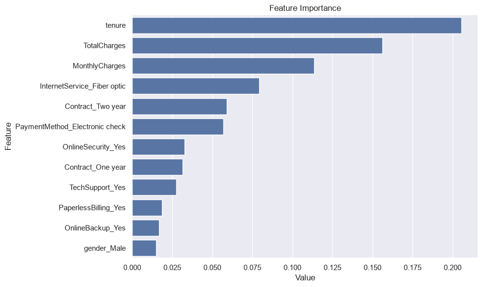

<div align="center">

# Customer Churn Prediction

**Predict which customers will churn and understand *why*, so retention can be targeted before they leave.**

An end-to-end churn-modelling project on the IBM Telco Customer Churn dataset,
built with [`eda-kit`](https://github.com/sahindemirbas/eda-kit), pandas and scikit-learn.


</div>

---

## Why churn matters

For any subscription business, **a lost customer is recurring revenue gone**, and acquiring a replacement costs far more than retaining an existing one. The two questions that actually matter are:

1. **Who** is likely to leave next?
2. **Why** are they leaving, so we can act rather than just predict?

This project answers both: a Random Forest predicts churn with a **ROC-AUC of 0.836**, and feature-importance analysis surfaces the business drivers behind churn.

## Results

| Model | Accuracy | Precision | Recall | F1 | ROC-AUC |
|-------|----------|-----------|--------|-----|---------|
| Baseline (dummy) | 0.734 | — | 0 | 0 | 0.500 |
| **Random Forest** | **0.795** | 0.645 | 0.505 | 0.567 | **0.836** |

> Accuracy alone is misleading on an imbalanced target (~26% churn), which is why ROC-AUC is the headline metric. The model lifts ROC-AUC from 0.50 (dummy) to **0.84**, a strong, decision-useful signal.

## What actually drives churn



The model's top predictors are business-readable, not black-box:

| Driver | Insight |
|--------|---------|
| **Tenure** | Churn concentrates in the first months of a relationship |
| **Total & Monthly charges** | Higher-value customers at risk |
| **Fiber-optic internet** | Service-quality / price-perception issue, not just "sell fiber" |
| **Short contracts (month-to-month)** | Longer contracts strongly retain |
| **Electronic-check payment** | Convenience/autopay gap → retention lever |

## Project structure

```
customer-churn-prediction/
├── data/                  # dataset (downloaded on first run)
├── notebooks/
│   └── churn_analysis.ipynb   # step-by-step walkthrough
├── src/
│   └── train_model.py     # full pipeline, one command
├── results/               # metrics.csv + plots
├── requirements.txt
└── README.md
```

## Quick start

```bash
git clone https://github.com/sahindemirbas/customer-churn-prediction.git
cd customer-churn-prediction
pip install -r requirements.txt
pip install git+https://github.com/sahindemirbas/eda-kit.git  # toolbox used here

python src/train_model.py          # run the full pipeline
# or open notebooks/churn_analysis.ipynb for the interactive walkthrough
```

## The pipeline (in one place)

The notebook and `src/train_model.py` both use the same `eda-kit` helpers:

1. **Structural EDA**: `ek.check_df`, `ek.grab_col_names`
2. **Missing values**: `TotalCharges` stored as text, blanks coerced & dropped
3. **Outlier handling**: capped with `ek.replace_with_thresholds` (no row loss)
4. **Encoding**: rare-class collapse (`ek.rare_encoder`) then one-hot (`ek.one_hot_encoder`)
5. **Stratified train/test split**: 80/20, class balance preserved
6. **Baseline first**: a dummy classifier establishes the floor
7. **Random Forest**: tuned architecture, evaluated on the held-out test set
8. **Interpretation**: `ek.plot_importance` turns the model back into business insight

## Author

**[Sahin Demirbas](https://github.com/sahindemirbas)**. Data Analyst & Data Scientist.
Food & beverage background, Python/SQL/Power BI, based in Cremona, Italy.
